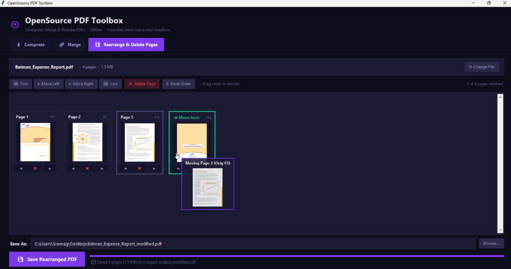

# OpenSource PDF Toolbox

<p align="center">
  
  
  
  
  
  
  <a href="https://www.linkedin.com/in/srnofficial" target="_blank"></a>
  <a href="https://buymeacoffee.com/sreeragrnandan" target="_blank"></a>
</p>

<p align="center">
  A lightweight, privacy-focused open-source desktop toolbox to <b>compress</b>, <b>merge</b>, <b>rearrange &amp; delete pages</b>, and <b>remove passwords</b> from PDFs — locally with zero cloud dependencies.
</p>

---

## ✨ Features

### ⚡ Compress

- **3 compression presets** — choose between lossless, balanced, or maximum compression
- **Batch processing** — compress multiple PDFs in one go
- **Drag & drop** — drop files directly onto the window
- **Live progress** — real-time progress bar with per-file status
- **Results panel** — see original size, compressed size, bytes saved, and % reduction
- **Custom output folder** — save anywhere or next to the original
- **Quick preview prompt** — open the compressed PDF immediately in your default viewer

### 🔗 Merge

- **Combine any number of PDFs** into a single output file
- **Reorder files** using ▲ ▼ buttons before merging
- **Double-click to remove** a file from the list
- **Custom output file name & location** via Save As dialog
- **Results panel** — shows files merged, total pages, and output size
- **Quick preview prompt** — open the merged PDF directly after creation

### 📑 Rearrange & Delete Pages

- **Interactive visual page grid** — view every page with live rendered thumbnails
- **Mouse drag & drop reordering** — click and drag any page card with your mouse to seamlessly drop it into a new position
- **Move controls** — precision move left (◀), right (▶), to first (⏮), or to last (⏭)
- **Delete unwanted pages** — remove any page with a single click (✕)
- **Safe & reversible** — "Reset Order" restores the original page sequence anytime
- **Live page counter** — displays retained and deleted page counts in real time
- **Quick preview prompt** — launch your newly organized PDF in the default viewer immediately

### 🔓 Unlock PDF

- **Remove passwords** from owner-protected or user-protected PDFs
- **Password field with show/hide toggle** — safely enter your password without exposing it
- **Smart error messages** — clear feedback for wrong passwords or unencrypted files
- **Drag & drop** — drop the protected PDF directly onto the window
- **Custom output folder** — save the unlocked file anywhere or next to the original
- **Output named distinctly** — saved as `<name>_unlocked.pdf` so the original is untouched
- **Quick preview prompt** — open the unlocked PDF immediately after processing

### 🛡️ Privacy & Performance

- **Non-destructive** — originals are never modified
- **100% Offline** — your files never leave your local machine

---

## 📸 Preview

<p align="center">
  
</p>

---

## 🗂️ Compression Levels

| Level                    | Technique                                      | Quality Impact                    |
| ------------------------ | ---------------------------------------------- | --------------------------------- |
| **🔵 Low — Lossless**    | Stream compression + object deduplication      | None — pixel-perfect              |
| **🟣 Medium — Balanced** | Above + image resampling to ~150 DPI           | Minimal — excellent for documents |
| **🔴 High — Maximum**    | Above + images compressed to ~96 DPI (JPEG 65) | Slight softening on photos        |

> **Tip:** For text-heavy PDFs (reports, invoices, contracts), even **High** mode looks identical — image quality only matters for photo-heavy documents.

---

## 🚀 Getting Started

### 🖥️ Windows — No install required

A pre-built standalone `.exe` is included in the repository root. Just double-click:

```
OpenSource PDF Toolbox.exe
```

> No Python, no pip, no setup needed. Everything is bundled inside.

#### Rebuild the EXE (after code changes)

Double-click **`build_exe.bat`**. It will:
1. Install / upgrade all dependencies
2. Build a fresh `OpenSource PDF Toolbox.exe` in the project root
3. Ask: **"Would you like to add a shortcut to your Desktop? (Y/N)"**

---

### 🐍 Run from source (Windows / macOS / Linux)

#### Prerequisites

- Python **3.9** or higher
- pip

#### Installation

```bash
# 1. Clone the repository
git clone https://github.com/sreeragrnandan/opensource-pdf-toolbox.git
cd opensource-pdf-toolbox

# 2. Install dependencies
pip install -r requirements.txt
```

#### Run

```bash
python pdf_tool_main.py
```

- **Windows users:** double-click `Launch PDF Tool Windows.bat` — no terminal needed.
- **macOS & Linux users:** run `./Launch\ PDF\ Tool Linux Mac.sh` (or `bash "Launch PDF Tool Linux Mac.sh"`).

---

## 📦 Dependencies

| Package                                                 | Version | Purpose                                                                      |
| ------------------------------------------------------- | ------- | ---------------------------------------------------------------------------- |
| [`pikepdf`](https://pikepdf.readthedocs.io/)            | ≥ 8.0   | PDF parsing, stream compression, object deduplication, and page manipulation |
| [`Pillow`](https://pillow.readthedocs.io/)              | ≥ 10.0  | Image extraction, thumbnail generation, and JPEG re-encoding                 |
| [`PyMuPDF`](https://pymupdf.readthedocs.io/)            | ≥ 1.23  | High-speed PDF page thumbnail rendering for the visual organizer             |
| [`tkinterdnd2`](https://github.com/pmgagne/tkinterdnd2) | ≥ 0.3   | Drag-and-drop support (optional)                                             |

> `tkinter` is part of Python's standard library and requires no separate install.

---

## 🗃️ Project Structure

```
opensource-pdf-toolbox/
│
├── OpenSource PDF Toolbox.exe    # ✅ Pre-built Windows standalone executable
├── pdf_tool_main.py              # Main entry point (Tkinter bootstrapping)
├── build_exe.bat                 # One-click EXE builder (with Desktop shortcut prompt)
├── PDF_Toolbox.spec              # PyInstaller build specification
├── Launch PDF Tool Windows.bat   # Windows source-mode launcher (requires Python)
├── Launch PDF Tool Linux Mac.sh  # macOS & Linux launcher script
│
├── assets/
│   ├── icon.ico                  # App icon (Windows .exe & taskbar)
│   ├── icon.png                  # App icon (PNG format)
│   └── preview.png               # README screenshot
│
├── core/                         # Core logic & algorithms (headless, zero GUI)
│   ├── __init__.py               # Core API exports
│   ├── dependencies.py           # Dependency checks (pikepdf, Pillow, PyMuPDF, TkinterDnD)
│   ├── utils.py                  # Format utilities, open_path helper
│   ├── compress.py               # Compression presets & processing
│   ├── merge.py                  # Multi-file PDF merger
│   ├── rearrange.py              # Page reordering, deletion, and thumbnail engine
│   └── unlock.py                 # Password removal engine
│
├── ui/                           # User Interface components
│   ├── __init__.py               # UI module export
│   ├── theme.py                  # Colors, fonts, reusable widget factories
│   ├── compress_tab.py           # Compression tab UI & worker thread
│   ├── merge_tab.py              # Merge tab UI & worker thread
│   ├── rearrange_tab.py          # Rearrange & Delete Pages visual grid UI
│   ├── unlock_tab.py             # Unlock PDF tab UI & worker thread
│   └── app.py                    # App shell, header, and tab navigation
│
├── requirements.txt              # Python dependencies
├── LICENSE                       # MIT License
└── README.md                     # Project documentation
```

---

## 🤝 Contributing

Contributions are welcome! Here's how to get started:

1. **Fork** the repository
2. **Create** a feature branch: `git checkout -b feature/your-feature`
3. **Commit** your changes: `git commit -m 'Add some feature'`
4. **Push** to the branch: `git push origin feature/your-feature`
5. **Open** a Pull Request

Please make sure your code follows the existing style and modular architecture.

### Ideas for contributions

- [ ] Split PDF tab (extract page ranges or split into individual pages)
- [ ] Rotate individual or all pages (90° / 180° / 270°)
- [ ] Metadata viewer & editor (title, author, creation date)
- [ ] PDF watermark / page number stamp tool
- [ ] Dark / Light theme toggle

---

## 🐛 Reporting Issues

Found a bug? Please [open an issue](https://github.com/sreeragrnandan/opensource-pdf-toolbox/issues) and include:

- Your OS and Python version (`python --version`)
- The error message or screenshot
- Steps to reproduce

---

## 📄 License

Distributed under the MIT License. See [`LICENSE`](./LICENSE) for more information.

---

## 🙏 Acknowledgements

- [pikepdf](https://pikepdf.readthedocs.io/) — PDF manipulation engine
- [PyMuPDF](https://pymupdf.readthedocs.io/) — High-speed PDF page rendering engine
- [Pillow](https://pillow.readthedocs.io/) — image processing
- [tkinterdnd2](https://github.com/pmgagne/tkinterdnd2) — drag-and-drop for Tkinter

---

## ☕ Support

If you find this project helpful and want to support its development, you can buy me a coffee or connect with me on LinkedIn!

<p align="left">
  <a href="https://buymeacoffee.com/sreeragrnandan" target="_blank">
    
  </a>
  &nbsp;&nbsp;
  <a href="https://www.linkedin.com/in/srnofficial" target="_blank">
    
  </a>
</p>

---

<p align="center">MIT Licensed · Open Source</p>
